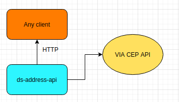

# ds-address-api

Este repositório contém a API de endereços para integração.

## Descrição
A API permite a pesquisa de endereços através de diferentes serviços, incluindo Via CEP. A integração com Via CEP permite obter informações detalhadas sobre endereços utilizando o número do CEP.

## Funcionalidades
- Busca de endereços por CEP
- Integração com Via CEP
- Respostas em formato JSON

## Estrutura do Projeto
- **src/**: Código-fonte da API
- **docs/**: Documentação e imagens

## Arquitetura
A arquitetura da API é representada na imagem abaixo:

## Requisitos
- Node.js
- Express

## Como Executar
1. Clone o repositório.
2. Execute `npm install` para instalar as dependências.
3. Execute `npm start` para inicializar a API.

## Contribuições
Contribuições são bem-vindas! Sinta-se livre para abrir issues ou PRs.